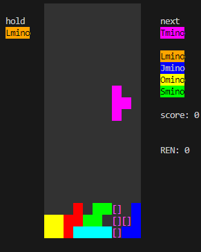

# 概要

これは[深層強化学習](https://github.com/char5742/TetrisAI)で使用しているテトリスシミュレータです。


## セットアップ
```console
git clone https://github.com/char5742/Tetris
julia --project
]
(Tetris) pkg> instantiate
```

画面描画にcursesを使用しています。Windowsの場合は同梱しているため、追加のインストールは不要です。
Macの場合は以下のコマンドでインストールしてください。
```console
brew install ncurses
```
その他OSは各自の環境に合わせてインストールしてください

## プレイ方法
```console
julia --project main.jl
```

## ゲームシステム

[ガイドライン](https://www.dropbox.com/s/g55gwls0h2muqzn/tetris%20guideline%20docs%202009.zip?dl=0&file_subpath=%2F2009+Tetris+Design+Guideline.pdf0)および[Tetris Channel](https://tetrisch.github.io/main/index.html)様を参考にしました。

### パラメータ

|      |     |
| ---- | --- |
| NEXT | 5   |
| FPS  | 60  |

### 操作方法

**Windows**
| 操作 | キー |
| ---- | --- |
| HOLD | Shift |
| Hard Drop | Space |
| Soft Drop | Down Arrow |
| 左回転 | Left Ctrl |
| 右回転 | Z or Up Arrow |
| 左移動 | Left Arrow |
| 右移動 | Right Arrow|
| 終了 | Esc |

**Mac**
| 操作 | キー |
| ---- | --- |
| HOLD | A |
| Hard Drop | Space |
| Soft Drop | Down Arrow |
| 左回転 | S |
| 右回転 | D or Up Arrow |
| 左移動 | Left Arrow |
| 右移動 | Right Arrow|
| 終了 | Q |